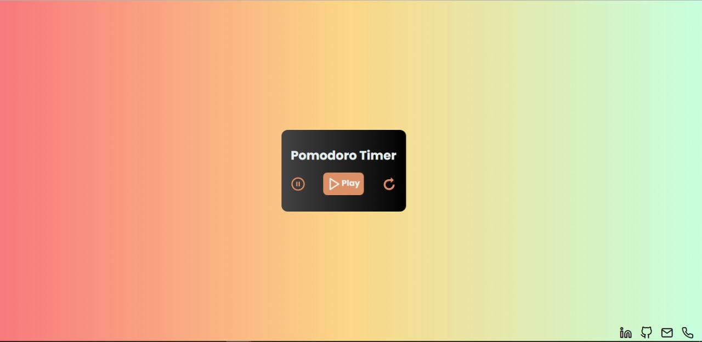
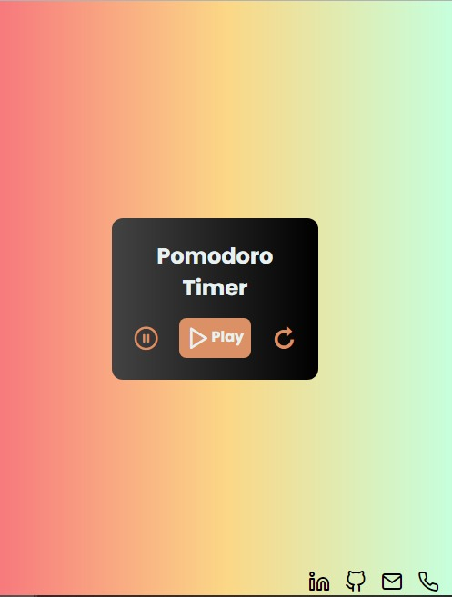

# **Pomodoro Timer**
## **Linguagens HTML/CSS e JavaScript**

<link rel="preconnect" href="https://fonts.googleapis.com">
<link rel="preconnect" href="https://fonts.gstatic.com" crossorigin>
<link href="https://fonts.googleapis.com/css2?family=Poppins:wght@700&display=swap" rel="stylesheet">

 

    Execução de um projeto onde desenvolvi um pomodoro, treinamento de HTML/CSS e Javascript. 

 
 

  Designs

 

### **Design Desktop**

 

 

### **Design Mobile**

 

